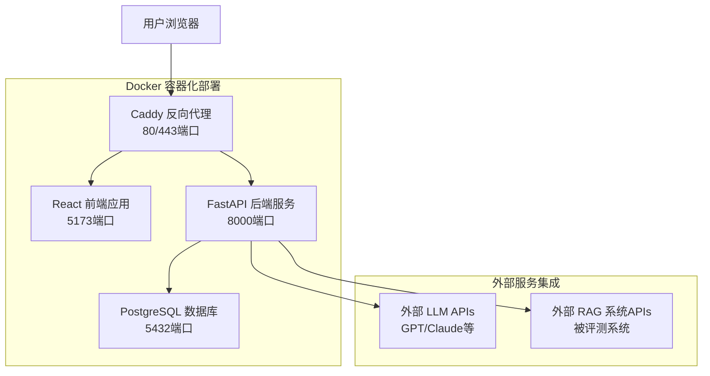

# 🔍 灵鉴（RAGEval）RAG评测系统 - 项目架构分析

## 📋 项目概述

**灵鉴（RAGEval）** 是一款专业的RAG（检索增强生成）系统评测工具，为AI应用开发者提供从数据准备、自动评测到报告生成的**全流程解决方案**。

- **项目性质**：开源RAG评测系统
- **开源协议**：MIT License
- **主要语言**：Python + TypeScript
- **架构模式**：前后端分离 + 微服务架构
- **部署方式**：Docker容器化部署

## 🏗️ 系统整体架构

这是一个**前后端分离的全栈 RAG 评测系统**，采用现代微服务架构设计：



### 架构特点
- **🐳 容器化部署**：使用Docker Compose一键部署
- **🔄 前后端分离**：React前端 + FastAPI后端
- **🌐 反向代理**：Caddy提供HTTPS和负载均衡
- **💾 数据持久化**：PostgreSQL关系型数据库
- **🔗 外部集成**：多种LLM和RAG系统API接入

## 🎨 技术栈详解

### 前端技术栈
| 技术 | 版本 | 用途 |
|------|------|------|
| **React** | 18.2.0 | 核心UI框架 |
| **TypeScript** | ~5.3.3 | 类型安全开发 |
| **Vite** | ^5.0.10 | 构建工具和开发服务器 |
| **Ant Design** | ^5.12.2 | 企业级UI组件库 |
| **Ant Design Pro** | ^2.8.6 | 高级组件和模板 |
| **TailwindCSS** | - | 原子化CSS框架 |
| **React Router** | ^6.20.0 | 前端路由管理 |
| **Redux Toolkit** | ^2.6.1 | 状态管理 |
| **Axios** | ^1.6.2 | HTTP客户端 |
| **Recharts** | ^2.15.1 | 数据可视化 |
| **CodeMirror** | ^4.23.12 | 代码编辑器 |
| **LangChain** | ^0.3.19 | AI应用开发框架 |

### 后端技术栈
| 技术 | 版本 | 用途 |
|------|------|------|
| **FastAPI** | 0.115.11 | 现代化Web框架 |
| **Python** | 3.9+ | 后端开发语言 |
| **SQLAlchemy** | 2.0.39 | ORM数据库操作 |
| **Pydantic** | >=2.11.5 | 数据验证和序列化 |
| **PostgreSQL** | 14 | 关系型数据库 |
| **Uvicorn** | 0.34.0 | ASGI服务器 |
| **JWT** | 2.10.1 | 身份认证 |
| **bcrypt** | 4.3.0 | 密码加密 |
| **pytest** | 8.3.5 | 单元测试框架 |
| **LlamaIndex** | 0.12.0 | RAG框架集成 |

### 部署与基础设施
| 技术 | 版本 | 用途 |
|------|------|------|
| **Docker** | - | 容器化部署 |
| **Docker Compose** | - | 多容器编排 |
| **Caddy** | - | Web服务器和反向代理 |
| **PostgreSQL** | 14 | 生产数据库 |

## 📁 项目目录结构

### 根目录结构
```
RAGEval/
├── 📂 rag-evaluation-frontend/    # React前端应用
├── 📂 rag-evaluation-backend/     # FastAPI后端服务
├── 📂 docker/                     # Docker配置文件
├── 📂 images/                     # 项目截图和logo
├── 📄 README.md                   # 项目说明文档
├── 📄 package.json                # Node.js依赖配置
├── 🚀 start_all.sh               # 启动脚本
└── 🚀 start_simple.sh            # 简化启动脚本
```

### 前端目录结构 (`rag-evaluation-frontend/`)
```
src/
├── 📱 components/                 # 可复用组件
│   ├── common/                   # 通用UI组件
│   ├── Layout/                   # 应用布局组件
│   ├── ConfigModal/              # 系统配置弹窗
│   └── JsonEditorField.tsx       # JSON编辑器组件
├── 📄 pages/                     # 页面组件
│   ├── Login/                    # 用户登录页面
│   ├── Dashboard/                # 系统仪表板
│   ├── Projects/                 # 项目管理页面
│   ├── CreateProject/            # 创建项目页面
│   ├── Datasets/                 # 数据集管理页面
│   ├── QuestionGeneration/       # AI问答生成页面
│   ├── Settings/                 # 系统配置页面
│   └── Admin/                    # 管理员功能页面
├── 🌐 services/                  # API服务层
│   ├── accuracy/                 # 精度评测服务
│   ├── performance/              # 性能测试服务
│   ├── auth.service.ts           # 认证服务
│   ├── dataset.service.ts        # 数据集服务
│   ├── project.service.ts        # 项目服务
│   └── llmProxyService.ts        # LLM代理服务
├── 🎣 hooks/                     # 自定义React Hooks
│   └── useConfig.ts              # 配置管理Hook
├── 🔗 router/                    # 路由配置
│   └── index.tsx                 # 主路由配置
├── 📝 types/                     # TypeScript类型定义
│   ├── dataset.ts                # 数据集类型
│   ├── question.ts               # 问题类型
│   └── question-generator.ts     # 问题生成类型
├── 🛠️ utils/                     # 工具函数
├── 📄 App.tsx                    # 根组件
├── 📄 main.tsx                   # 应用入口
└── 🎨 index.css                  # 全局样式
```

### 后端目录结构 (`rag-evaluation-backend/`)
```
app/
├── 🌐 api/                       # API接口层
│   ├── api_v1/                   # API版本1
│   │   ├── endpoints/            # 具体端点实现
│   │   │   ├── users.py          # 用户管理API
│   │   │   ├── auth.py           # 认证授权API
│   │   │   ├── projects.py       # 项目管理API
│   │   │   ├── questions.py      # 问题管理API
│   │   │   ├── rag_answers.py    # RAG回答收集API
│   │   │   ├── accuracy.py       # 精度评测API
│   │   │   ├── performance.py    # 性能测试API
│   │   │   ├── file_parser.py    # 文件解析API
│   │   │   └── mineru_convert.py # 文档转换API
│   │   └── api.py                # 路由注册
│   └── deps.py                   # 依赖注入
├── 🏛️ models/                    # SQLAlchemy数据模型
│   ├── user.py                   # 用户模型
│   ├── project.py                # 项目模型
│   ├── question.py               # 问题模型
│   ├── rag_answer.py             # RAG回答模型
│   ├── accuracy.py               # 精度评测模型
│   ├── performance.py            # 性能测试模型
│   ├── dataset.py                # 数据集模型
│   └── api_key.py                # API密钥模型
├── 📋 schemas/                   # Pydantic数据模式
│   ├── user.py                   # 用户数据模式
│   ├── project.py                # 项目数据模式
│   ├── question.py               # 问题数据模式
│   ├── rag_answer.py             # RAG回答数据模式
│   ├── accuracy.py               # 精度评测数据模式
│   ├── performance.py            # 性能测试数据模式
│   └── dataset.py                # 数据集数据模式
├── ⚙️ services/                  # 业务服务层
│   ├── user_service.py           # 用户管理服务
│   ├── project_service.py        # 项目管理服务
│   ├── question_service.py       # 问题管理服务
│   ├── rag_service.py            # RAG系统交互服务
│   ├── accuracy_service.py       # 精度评测服务
│   ├── accuracy_evaluator.py     # 精度评估引擎
│   ├── performance_service.py    # 性能测试服务
│   ├── dataset_service.py        # 数据集管理服务
│   ├── file_parser_service.py    # 文件解析服务
│   └── llm_service.py            # 大语言模型服务
├── 💾 db/                        # 数据库配置
│   ├── base.py                   # 基础配置
│   ├── init_db.py                # 数据库初始化
│   └── create.sql                # 建表脚本
├── 🔧 core/                      # 核心配置
│   ├── config.py                 # 系统配置
│   └── security.py               # 安全配置
├── 🛠️ utils/                     # 工具模块
│   └── security.py               # 安全工具
├── 📄 main.py                    # FastAPI应用入口
└── 📄 requirements.txt           # Python依赖清单
```

### Docker配置目录 (`docker/`)
```
docker/
├── 📄 docker-compose.yml         # 容器编排配置
├── 🐳 Dockerfile.backend         # 后端Dockerfile
├── 🐳 Dockerfile.caddy           # Caddy Dockerfile
├── 🌐 Caddyfile                  # Caddy配置文件
├── 🗄️ sql.sql                    # 数据库初始化脚本
├── 📚 README.md                  # 部署说明文档
├── 📚 CONFIGURATION.md           # 配置说明文档
└── 📚 MIGRATION.md               # 迁移指南
```

## 🚀 核心功能模块

### 1. 🤖 AI 智能功能
- **文档解析与切分**
  - 支持多种文档格式（PDF、Word、TXT等）
  - 自动文档切分和预处理
  - 基于LlamaIndex的智能解析
  
- **问答对生成**
  - 集成多种大模型API（GPT、Claude等）
  - 并行调用提升生成效率
  - 支持批量生成和自定义prompt
  
- **质量保证**
  - 自动验证生成数据的完整性
  - 数据质量评估和过滤
  - 支持人工审核和编辑

### 2. 📊 RAG 系统评测
- **精度评测**
  - 多维度评估（准确性、相关性、完整性、一致性）
  - AI自动评分和分析
  - 支持多个RAG系统横向对比
  
- **性能测试**
  - 响应时间测试（端到端延迟）
  - 首Token时间测量
  - 平均字符生成时间
  - 并发性能测试
  - 吞吐量评估
  
- **对比分析**
  - 多系统性能对比
  - 评测结果可视化
  - 详细的性能指标分析

### 3. 📈 数据分析与报告
- **实时监控**
  - 评测过程实时状态显示
  - 进度条和状态更新
  - 异常监控和报警
  
- **可视化图表**
  - 使用Recharts和Ant Design Charts
  - 性能趋势图表
  - 精度分布图
  - 对比雷达图
  
- **报告生成**
  - 支持PDF导出
  - Excel数据导出
  - 自定义报告模板

### 4. 🔧 系统配置与管理
- **多模型支持**
  - OpenAI GPT系列
  - Anthropic Claude系列
  - 支持自定义API endpoint
  
- **RAG系统接入**
  - 通用API接口设计
  - 支持各种RAG系统配置
  - 标准化的评测接口协议
  
- **用户权限管理**
  - 管理员和普通用户权限分离
  - 基于角色的访问控制
  - 用户活动日志记录

## 🔗 外部服务集成

### 大模型API集成
```python
# 支持的LLM提供商
LLM_PROVIDERS = {
    'openai': {
        'models': ['gpt-4', 'gpt-3.5-turbo'],
        'endpoint': 'https://api.openai.com/v1'
    },
    'anthropic': {
        'models': ['claude-3', 'claude-2'],
        'endpoint': 'https://api.anthropic.com'
    },
    'custom': {
        'models': ['自定义模型'],
        'endpoint': '自定义endpoint'
    }
}
```

### RAG系统接入标准
- **标准化API接口**：支持RESTful API调用
- **配置化接入**：通过配置文件定义RAG系统参数
- **错误处理**：完善的异常处理和重试机制
- **性能监控**：自动记录响应时间和状态码

## 🛡️ 安全特性

### 身份认证与授权
- **JWT Token认证**：无状态身份验证
- **密码安全**：bcrypt哈希加密存储
- **会话管理**：Token过期和刷新机制
- **权限控制**：基于角色的访问控制

### 数据安全
- **输入验证**：Pydantic数据模型验证
- **SQL注入防护**：SQLAlchemy ORM保护
- **CORS配置**：跨域访问控制
- **敏感信息加密**：API密钥加密存储

### 网络安全
- **HTTPS支持**：Caddy自动TLS证书
- **反向代理**：隐藏内部服务端口
- **容器隔离**：Docker容器网络隔离

## 📊 数据库设计

### 核心数据表
- **users**: 用户信息表
- **projects**: 项目管理表
- **datasets**: 数据集管理表
- **questions**: 问题数据表
- **rag_answers**: RAG回答记录表
- **accuracy_evaluations**: 精度评测结果表
- **performance_tests**: 性能测试记录表
- **api_keys**: API密钥管理表

### 数据关系
```sql
-- 用户与项目：一对多关系
users (1) --> (N) projects

-- 项目与数据集：多对多关系  
projects (N) <--> (N) datasets

-- 数据集与问题：一对多关系
datasets (1) --> (N) questions

-- 问题与RAG回答：一对多关系
questions (1) --> (N) rag_answers

-- RAG回答与评测结果：一对一关系
rag_answers (1) --> (1) accuracy_evaluations
```

## 📦 部署方案

### Docker一键部署（推荐）
```bash
# 1. 克隆项目
git clone https://github.com/momomo623/RAGEval.git
cd RAGEval

# 2. 启动所有服务
cd docker
docker-compose up -d

# 3. 访问应用
http://localhost
```

### 手动部署
```bash
# 后端部署
cd rag-evaluation-backend
pip install -r requirements.txt
uvicorn app.main:app --host 0.0.0.0 --port 8000

# 前端部署
cd rag-evaluation-frontend
npm install
npm run dev

# 数据库配置
# PostgreSQL 14+，执行 docker/sql.sql 初始化脚本
```

### 生产环境配置
- **负载均衡**：Caddy提供负载均衡和自动HTTPS
- **数据持久化**：Docker volumes持久化数据
- **监控告警**：集成日志监控和健康检查
- **备份策略**：数据库定期备份和恢复机制

## 🔧 开发环境搭建

### 前端开发
```bash
cd rag-evaluation-frontend
npm install
npm run dev  # 开发服务器运行在 http://localhost:5173
```

### 后端开发
```bash
cd rag-evaluation-backend
python -m venv venv
source venv/bin/activate  # Linux/Mac
pip install -r requirements.txt
uvicorn app.main:app --reload  # 开发服务器运行在 http://localhost:8000
```

### 数据库开发
```bash
# 安装PostgreSQL
brew install postgresql  # macOS
brew services start postgresql

# 创建数据库
psql postgres
CREATE DATABASE rag_evaluation;
CREATE USER postgres WITH PASSWORD 'postgres';
GRANT ALL PRIVILEGES ON DATABASE rag_evaluation TO postgres;

# 初始化表结构
psql -U postgres -d rag_evaluation -f docker/sql.sql
```

## 📈 性能优化

### 前端优化
- **代码分割**：React.lazy和动态导入
- **组件缓存**：React.memo和useMemo优化
- **图片优化**：懒加载和压缩
- **Bundle优化**：Vite的Tree Shaking

### 后端优化
- **异步处理**：FastAPI异步特性
- **数据库优化**：索引和查询优化
- **缓存策略**：Redis缓存热点数据
- **并发处理**：多进程和异步IO

## 🚀 扩展性设计

### 水平扩展
- **微服务架构**：服务可独立部署和扩展
- **容器化部署**：Docker支持容器编排
- **负载均衡**：支持多实例部署
- **数据库分片**：支持数据库水平分割

### 功能扩展
- **插件系统**：支持自定义评测算法
- **多语言支持**：国际化框架
- **API扩展**：RESTful API标准化设计
- **集成能力**：支持第三方系统集成

## 📚 文档与维护

### 技术文档
- **API文档**：自动生成的Swagger文档
- **部署文档**：详细的部署和配置指南
- **开发文档**：代码结构和开发规范
- **用户手册**：功能使用说明

### 代码质量
- **类型检查**：TypeScript和Pydantic类型安全
- **代码规范**：ESLint和Prettier格式化
- **单元测试**：pytest测试框架
- **代码审查**：Git工作流和PR检查

## 📄 总结

**灵鉴（RAGEval）** 是一个**企业级的RAG评测解决方案**，具备以下特点：

✅ **现代化技术栈**：React 18 + FastAPI + PostgreSQL
✅ **容器化部署**：Docker一键部署，生产环境就绪
✅ **全面的评测功能**：精度评测 + 性能测试 + 对比分析
✅ **良好的扩展性**：模块化设计，支持自定义扩展
✅ **企业级安全**：JWT认证 + 权限控制 + 数据加密
✅ **优秀的用户体验**：现代化UI设计 + 实时监控
✅ **完善的文档**：详细的技术文档和使用指南

该系统非常适合作为**RAG系统评测的标准平台**使用，可以帮助开发者全面评估和优化RAG应用的性能和质量。


